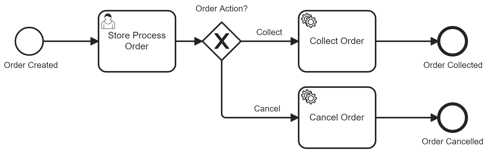
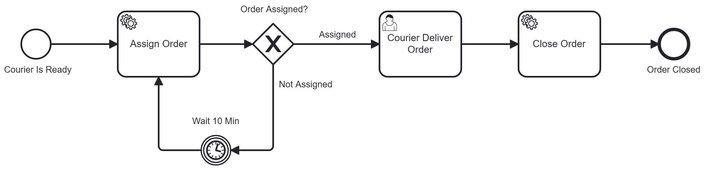

# Lab Work #4
### Task

### BPMN 2.0 Diagrams

### Как сделать, чтобы всё работало
1. Дропнуть все таблицы камунды перед запуском приложения
2. Заказ создавать запуском процесса с аккаунта админа в камунде
3. Store собирает заказ через камунду
4. Courier через апи говорит, что он ready
5. Courier в камунде получает задание на заказ и выполняет его
6. Не использовать методы контроллеров, помеченные @Deprecated
