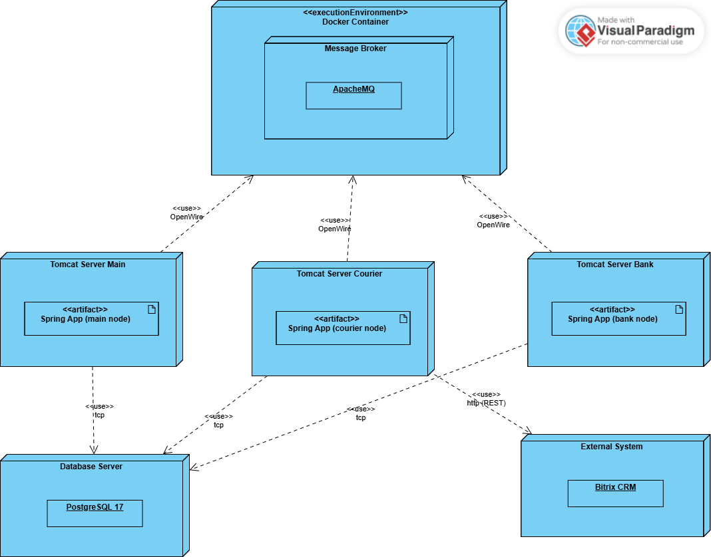

# Lab Work #3
### Task


### BPMN 2.0 Diagram


### Deployment Diagram


### Setting up ActiveMQ
1. Pull docker image of ActiveMQ: `docker pull rmohr/activemq:5.15.9-alpine`
2. Run ActiveMQ: `docker run -p 61616:61616 -p 8161:8161 rmohr/activemq:5.15.9-alpine`
3. ActiveMQ console will be available at http://localhost:8161/admin (default credentials: admin/admin)

### Running the Application
You need to run all three nodes separately:

1. **Main Node**:
```
mvn spring-boot:run -Dspring-boot.run.main-class=com.delivery.MainNodeApplication
```
2. **Bank Node**:
```
mvn spring-boot:run -Dspring-boot.run.main-class=com.delivery.BankNodeApplication
```
3. **Courier Node**:
```
mvn spring-boot:run -Dspring-boot.run.main-class=com.delivery.CourierNodeApplication
```